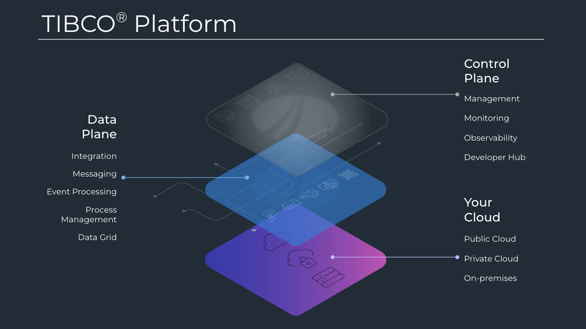
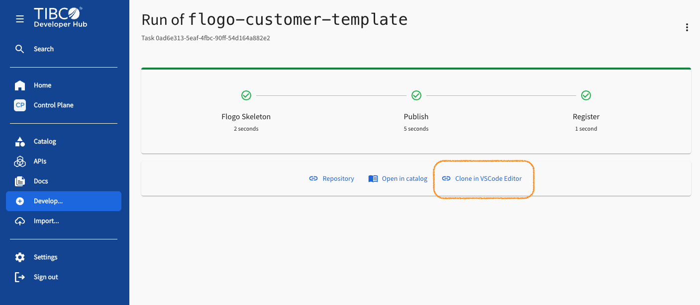
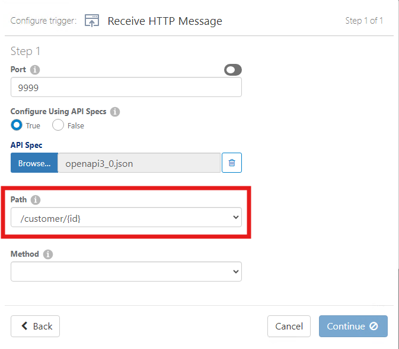
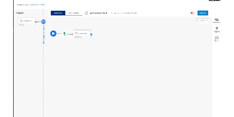
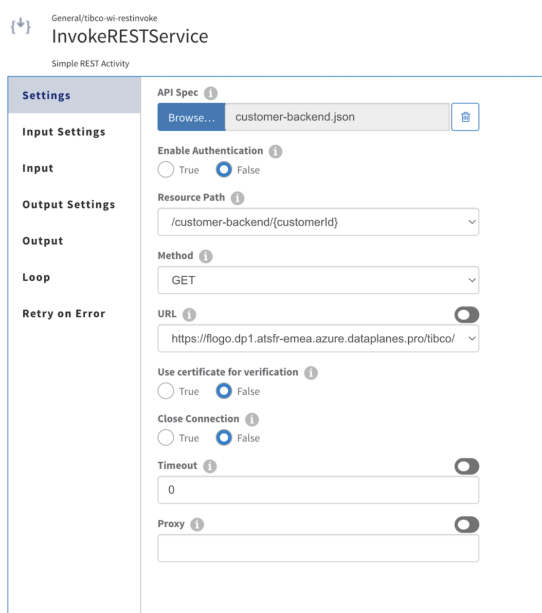

# TIBCO Platform Workbook

Version 1.0



## Objectives

The objective of this workshop is to give customers a taster of the new TIBCO Platform capabilities available today (platform version 1.4.0)

This workbook provides a use-case for customers to follow using the provided lab environment. The environment consists of:

- Windows Desktop containing development tooling

- Linux Server running a TIBCO Control Plane and two Data Planes (K8S and Bare Metal)

## Section 1 - Build an API using Flogo and deploy to TIBCO Platform

> Dave works for a small company as the TIBCO expert. You take the place of Dave who has years of experience in TIBCO and is 'itching' to use the new TIBCO Platform his company has available. He has years of BusinessWorks 5 experience, but is fairly new to TIBCO Flogo.
>
>His manager Steve bursts into his office one morning.
>
>"Dave, look we're up against the clock; the Spring development team is struggling to get the new Customer API built in time for the launch of the new DXP platform. The front-end development squad are blocked waiting for a working API to call and have asked me if you can build something quickly using TIBCO?"
>
>"Sure you reply, I have just the right tools for the job. Exactly what do I need to build? Has the API Product Owner got the specification?"
>
>"Yes, and the backend service is already available too!" Steve replied anxiously.
>
>What you need to do...
>
>Your first task is to create the new Customer API using TIBCO Flogo and get it deployed to the TIBCO Platform Integration environment.
>
>The customer backend service is here for you and there's some data ready for you to use.


### Task 1 - Create your project

> Objective: Create a new project from a Flogo template in the Developer Hub

1. Connect to the TIBCO Platform using the following URL https://tibcoatseuwe4.eu-west.my.tibco.com/cp/app/dashboard and select Developer Hub


2. On the right menu, click on Develop... and select the template Customer API Template


3. Fill in the form values as following - Replace YourName by your name, ideally in lower case :

Name | Value
--|--   
Name|customer-api-YourName
Description|A service that calls a backend customer service using Flogo - developped by YourName
HTTP port to expose|10000
Owner|group:default/tibco-platform-workshop

4. Click on Review button, review all the details then click on Create


5. A new Github repository has been created, click on Repository link to view the source code


6. Copy the link from github, then download the project on your laptop. Open a Command Prompt, and run the following commands:

```
git clone <Github repo url>
cd customer-api-YourName
code .
```


### Task 2 - Implement the getCustomerById operation

> [!NOTE]  
> Objective: The getCustomerById operation should retrieve a customer from tha bzckend service using the {id} path parameter and return a Customer JSON object.


#### Step 1 - Review the Open API Specification

1. Open the newly imported customer.json specification from the Explorer View in the folder spec. From within the editor window, press the **SHIFT+ALT+P** key combination to bring up Swagger Preview window.

> [!TIP]  
> If it does not work, please install the extension "OpenAPI (Swagger) Editor"


2. Review the ‘Retrieve a customer object’ API. 
   
* It uses the HTTP GET method with a path of /customer/{id} and returns two HTTP response codes of 200 or 400.  
* A response code 200 should return a JSON object of the customer that matches the id parameter. 
* If no customer object exists then the API must return a 400 response code.
   


3. Once you have familiarised yourself with the specification then go ahead and close the Swagger Preview and the Editor windows.

#### Step 2 - Open the Flogo Application

1. Open the file src/customer-api.flogo. The Flogo Plugin will launch to show the following viewport.


#### Step 3 - Create Flogo App Trigger

In this section, we will perform the following:

- Create a Trigger to receive a HTTP Message
- Use the API specification to configure the trigger

1. Hover over the **No trigger**, a context pop-up will appear showing **+ Add trigger**. Click to add a trigger to the Flogo Application


2. From the Triggers bar, locate the **Receive HTTP Message** Trigger and drag it over to the Triggers section.


The following dialog will be shown:


3. Change the **Configure Using API Specs** from False to True.

4. Click the **Browse...** button now highlighted


5. An Open dialog box will appear, now navigate to your API specification file saved earlier under the **spec** folder. Select the file **customer.json** and click **Open**

6. Configure **Path** by selecting the drop-down menu, select the **/customer/{id}** option:



7. Configure **Method** by selecting the drop-down menu, select **GET** option:


8. Click **Continue**.

9. A dialog box will appear asking **Do you want to copy this triggers Output Schema into the Flows Inputs?**. Click the **Copy schema** button.


11. Nice work so far, you're well on your way to finishing your first API in Flogo. The Trigger has now been configured for the **GET /customer/{id}** operation ready for you to implement the API logic.

#### Step 4 - Develop the getCustomerById Flow

In this section, we will perform the following:

- Implement logic to retrieve customer data from the REST backend service and return the Customer JSON reply with a 200 response code.
- Handle logic if no row is returned from the REST backend service and return a 400 response code.
  
The complete flow will look like this:


| Activity Name | Type | Purpose |
|---|---|---|
|  |  |  |
| LogMessage | Log | Log a message containing the customer identifier passed into the operation |
| CallBackendService | Invoke REST Service | Retrieve customer data from the customer backend service that matches its primary key |
| MapperCustomer | Mapper | Create a JSON Customer object and populate with values returned from the backend service |
| Return200 | Return | Return a 200 HTTP response code with a Customer JSON response body |
| LogMessageWarnNotFound | Log | Log a warning message if the record is not found in the database |
| Return400 | Return | Return a 400 HTTP response code and an empty response body when no customer record exists in the database |

**LogMessage Activity**

> [!NOTE]  
> Objective: Log a message containing the customer identifier passed into the operation.

1. Drag a **Log Message** from the Activity Bar -> General onto the canvas.


2. Configure the LogMessage activity, set the Activity inputs->message field to the following expression:

| Field | Expression |
|---|---|
| message | ``string.concat('Retrieving customer object for id: ',coerce.toString($flow.pathParams.id)`` |


The LogMessage activity Input should look like this:


**CallBackendService Activity**

> [!NOTE]  
> Objective: Retrieve a row from the customer table that matches its primary key.

1. Drag a ***Invoke REST Service*** activity from the Activity Bar -> General onto the canvas and connect to LogMessage activity. Rename the activity to **CallBackendService**.



2. Configure the CallBackendService activity Settings to use OpenAPI specification **customer-backend.json** in the **spec** folder. The CallBackendService activity Settings should look like this:



3. Configure the CallBackendService activity Input. Map the flow path parameter value (passed from the Trigger URL Path /customer/{id} to the Flow) to the bounded parameter ?id:

The CallBackendService activity Input should look like this:


**MapperCustomer Activity**

> [!NOTE]  
> Objective: Create a JSON Customer object and populate with values returned from the database.

1. Drag a **Mapper** activity from the Activity Bar -> General -> Mapper onto the canvas and connect to CallBackendService activity. Rename the activity to **MapperCustomer**.


2. Add the following JSON representation to the **MapperCustomers** Input Settings. This will form the response object we reply back with. Click Save.

```
{
  "id":1,
  "name": "John Doe",
  "email": "john.doe@example.com",
  "age": 30,
  "city": "New York"
}
```


> [!TIP]  
> You can also use pre defined schemas, using the button on top of the box "
> 


3. Map the Input of the MapperCustomer activity from the Output of the CallBackendService activity.

| Field | Expression |
|---|---|
| id | $activity[CallBackendService].responseCodes["200"].id |
| name | $activity[CallBackendService].responseCodes["200"].name |
| email | $activity[CallBackendService].responseCodes["200"].email |
| age | $activity[CallBackendService].responseCodes["200"].age |
| city | $activity[CallBackendService].responseCodes["200"].city |


**Return200 Activity**

> [!NOTE]  
> Objective: Return a 200 HTTP response code with a Customer JSON response body.

1. Drag a **Return** activity from the Activity Bar -> Default-> Return onto the canvas and connect to MapperCustomer activity. Rename the activity to **Return200**.


2. Map the Outputs of the Return200 activity. Set the **code** field to 200 and responseBody->body to the MapperCustomer->output. Click Save.

| Field | Expression |
|---|---|
| code | 200 |
| responseBody/body | $activity[MapperCustomer].output |


### Task 3 - Optional - Implement the Not Found path

**LogMessageWarnNotFound Activity**

> [!NOTE]  
Objective: Log a warning message if the record is not found in the database.

1. Drag a **Log** activity from the Activity Bar -> General-> Log onto the canvas and connect to CallBackendService activity. Rename the activity to **LogMessageWarnNotFound**.


2. On the activity settings panel change the Log Level to Warn.

3. On the activity Input panel set Activity input -> message to the following expression:

| Field | Expression |
|---|---|
| message | string.concat('No records returned for customer id: ',coerce.toString($flow.pathParams.id))
 |


**Return400 Activity**

> [!NOTE]  
> Objective: Return a 400 HTTP response code and an empty response body when no customer record exists in the database.

1. Drag a **Return** activity from the Activity Bar -> Default-> Return onto the canvas and connect to LogMessageWarnNotFound activity. Rename the activity to **Return400**.


3. Map the Outputs of the Return400 activity. Set the **code** field to 400. Set the responseBody->body to **'Customer not found'**. Click Save.

| Field | Expression |
|---|---|
| code | 400 |
| responseBody/body | '' |


**CallBackendService to MapperCustomer Branch**

> [!NOTE]  
> Objective: Conditional branch logic is required from CallBackendService and MapperCustomer activities so that when a row is found the flow executes our 200-OK response scenario.


1. Click the **Green** condition between CallBackendService and MapperCustomer to open the dialog box for Branch Mapping Settings. Change the branch type to **Success with condition**. Set the conditional expression. Click Save.

| Expression |
|---|
| `$activity[InvokeRESTService].statusCode==200` |


**CallBackendService to LogMessageWarnNotFound Branch**

> [!NOTE]  
> Objective: Conditional branch logic is required from CallBackendService to LogMessageWarnNotFound activities so that when no row is found the flow executes our 400-NotFound response scenario.

1. Click the **Green** condition between CallBackendService and LogMessageWarnNotFound to open the dialog box for Branch Mapping Settings. Change the branch type to **Success with no matching Condition**. Click **Save**.


**Rename the Flow to getCustomerById**

Finally, now we have finished implementing the flow, let's give it a proper name to match the API specification operationID.

1. Click the **New_flow** label and change it to **getCustomerById**.


2. Click the description label and change it to **Returns a customer object by Id**.

3. Now, Use File -> Save to make sure all your changes are saved to disk.


### Task 4 - Build the Application Locally

> [!NOTE]  
> Objective: Now you have implemented your Customer API let's go ahead and build an executable that we can then use to test it locally through curl.

1. At the bottom-left of Visual Studio Code, you will see the Flogo App panel. Click the expand arrow


The Flogo plugin for Visual Studio Code can target builds for either Local or TIBCO Platform. With local build it is no longer necessary to compile your flogo application via TIBCO Cloud Integration platform, everything is done on the developer machine.

2. Select a runtime


3. Select local runtime and click build


4. After a few minutes you will see a pop-up dialog message declaring **File built successfully**.


5. Expand the bin folder in your explorer panel to reveal the generated executable for your customer api.


6. Right click on the customer-api.exe, select Reveal in File Explorer. Launch the customer-api.exe


7. Launch a new command prompt and run the following command:

```
curl -i http://localhost:9999/customer/1
```


8. Now try and use an Id value that does not exist in the database (e.g. 9), the Customer API should return a 400 response.


9. As we have now tested our application, you can go back to running application and press "ctrl-c" to exit the application, before we move onto creating Unit Tests below.

### Task 5 - OPTIONAL - Create Unit Tests

> [!NOTE]  
> Objective: Flogo supports the ability to create unit tests that can be used to verify the functionality of your applications flow logic through a test case/suite model. We will write a test case to verify that the getCustomerById flow correctly returns the correct customer for Id=1.


4. Click **Flow Input** and assign Flow Inputs Path Parameter Id to 1. Click Save and Close.


5. Click **Flow Output**. Select **Assert On Outputs** from the dropdown menu. Select **+** to add a new assertion. Name the assertion **Return 200 success**.  

6. Select **Outputs/output/code** from the Available Data pane and drag-and-drop onto the assertion expression. 

7. Set the assertion logic to **$flow.code == 200**. Click Save and Close.


8. Click **MapperCustomer**. Select **Assert on Outputs** from the dropdown menu. Select **+** to add a new assertion. Name the assertion **CheckMapperOutput**. 

9. Select **Outputs/output/id** from the Available Data pane and drag-and-drop onto the assertion expression.

10. Set the assertion logic to **$activity[MapperCustomer].output.id==1**.  

11. Append the expression with a Boolean-And **&&**.  Similarly the same with **name** field but add equality **==** to the term and check that the name field equals **John Doe**.

The complete expression should be: 

```
$activity[MapperCustomer].output.id==1 && $activity[MapperCustomer].output.name=="John Doe"
```

Click Save and Close.


The Flogo Application will be compiled and the unit test will be executed. The terminal window will show the results of running the unit test suite:


> Please Note: If the test suite above did not start - please make sure that the application is not already running, if it is running - just exit the application using "ctrl-c" and try re-running the unit test.


## Section 2 - Build & Deploy to TIBCO Platform

> [!NOTE]  
> Objective: To deploy the Customer API to a Dataplane on the TIBCO Platform from Visual Studio Code.

Before we start deploying to the TIBCO Platform, we first need to make sure that Visual Studio Code and the Flogo plugin is authenticated against the platform, otherwise our deploy steps will fail.

### Task 1 - Re-Authenticate against the TIBCO Control Plane

1. Find the Flogo icon in the project explorer on the left hand side of Visual Studio Code and click on it:


2. If you expand the "Platform" tree followed by "Apps", you will see an error similar to the following:


3. This tells us that we are not logged into the platform and we will need to re-authenticate. To do that, if you hover over the "Platform" tree, you can choose the "Pencil" icon to edit the connection:


4. Follow the steps to re-authenticate against the TIBCO Platform. Use all the defaults. DO NOT FORGET TO PRESS SAVE!


5. We can now go back to our Flogo Application to continue the steps below to deploy it to the Data Plane. To return to our application - click on the Folder button in the left hand toolbar:


### Task 2 - Build & Deploy to TIBCO Platform

1. Configure Flogo to use Platform Runtime Profile by clicking on the configuration icon:


2. A dialog box will appear at the top of Visual Studio Code to select runtime. Choose **platform**.


3. The Flogo Actions will now show a further option **Deploy** to allow you to deploy your Flogo Application to TIBCO Platform. Click the triangle next to the **Deploy Action** to run the action


A pop-up box will be shown during the deployment run action.


Once the pop-up disappears your Customer API will be deployed to your TIBCO Platform Dataplane. Let's now login to TIBCO Control Plane to see your newly deployed Customer API.

## Section 3 - Managing your Applications using TIBCO Platform

### Task 1 - Login to TIBCO Control Plane

> [!NOTE]  
> Objective: To familiarise users of the TIBCO Control Plane

1. Login to TIBCO Control Plane via the desktop shortcut provided **Control Plane**.


2. On the Home landing page you can see your newly deployed application **customer-api-[YOUR NAME]** has been deployed to a Kubernetes-based Data Plane **atsfr-dp-aks** and that its Status is **Running**.


4. By default your application has been deployed with a private endpoint, so in order for the API to be consumed externally it must have its endpoint visibility set to public.

### Task 2 - Expose Customer API endpoint to public traffic

> [!NOTE]  
> Objective: Any newly deployed application is configured with a private endpoint on a designated TIBCO Data Plane. To expose the Customer API endpoint we must make it public.


2. Click **Set Endpoint Visibility**


3. Update Endpoint visibility to Public by selecting the **Flogo Ingress** and setting the Service Path Prefix to /customer-api/v1. Click **Update Endpoint visibility to Public**.


4. Your API will now be exposed publicly at the following endpoint of:

```
https://flogoapps.localhost.dataplanes.pro/customer-api/
```
5. Paste the following URL into a browser window to check your API is running correctly. This will invoke the Get Customer By ID operation you have just implemented.

```
https://flogoapps.localhost.dataplanes.pro/customer-api/v1/customer/1
```


### Task 3 - Observability

> [!NOTE]  
> Objective: TIBCO Platform provides comprehensive observability data for applications deployed. A health dashboard of each Dataplane provides 'at-a-glance' information. Flows/Activities measurements, Machine Resource for CPU & Memory utilisation, and Success/Failure Counters of Applications deployed to the Platform.

### Task 4 - View Application Logs

> [!NOTE]  
> Objective: The TIBCO Platform integrates log forwarding to internal logging services provided to the TIBCO Platform via Elastic Stack. 
> The TIBCO Platforms Control Plane allows you to quickly access your TIBCO Application logs to quickly find any log records written by any Log Activities added to your application logic.

1. Open the Logs view for the customer-api application


2. The default is provide historical log view, let's stream logs in Realtime by selecting **Realtime option**. You will observe that the last log entry shows our log message **Retrieving customer object for id: 1**.


### Task 5 - View Application Traces 

> [!NOTE]  
> Objective: To observe application telemetry information for distributed traces in order to identify performance issues.

1. TIBCO Platform uses Open Telemetry tooling built in to provide observability of any TIBCO applications deployed to your TIBCO Dataplanes. By default this is disabled on newly deployed applications so we will need to enable it using the Environmental Controls settings.

2. Open the Environmental Controls page. Click Engine Variables. Set the **FLOGO_OTEL_TRACE** value to **true**. Click 'Push Updates'


3. The TIBCO Platform will re-configure the deployed application and now Open Telemetry Tracing for this application will be configured.

4. Using your browser, fire some more requests to the API E.g. Customer 1,2 and 5.

5. Click Traces page to view the captured Open Telemetry Span Metrics:


6. Click one of the spans to drill down into.


7. In this trace we can see that the CallBackendService activity took a proportionally long time of 3.16ms to execute compared to the overall execution time of 3.26ms for the entire API call.


8. Expand the top-level Span **Tags** section to reveal the attributes captured. The attribute value for **flogo.flow.id** can be used to find log entries relating to this particular flow.


### Task 6 - Scaling Applications

> [!NOTE]  
> Objective: TIBCO Platform utilises Kubernetes for FT/HA thus ensuring your applications remain running at all times. When demand requires, any application can be scaled up or down through the TIBCO Control Plane.

1. Scaling the Customer application to 2 by toggling the up-arrow above the [1]. Click the **Scale** button.


2. Now scale your app to zero. Your application is stopped.

---


